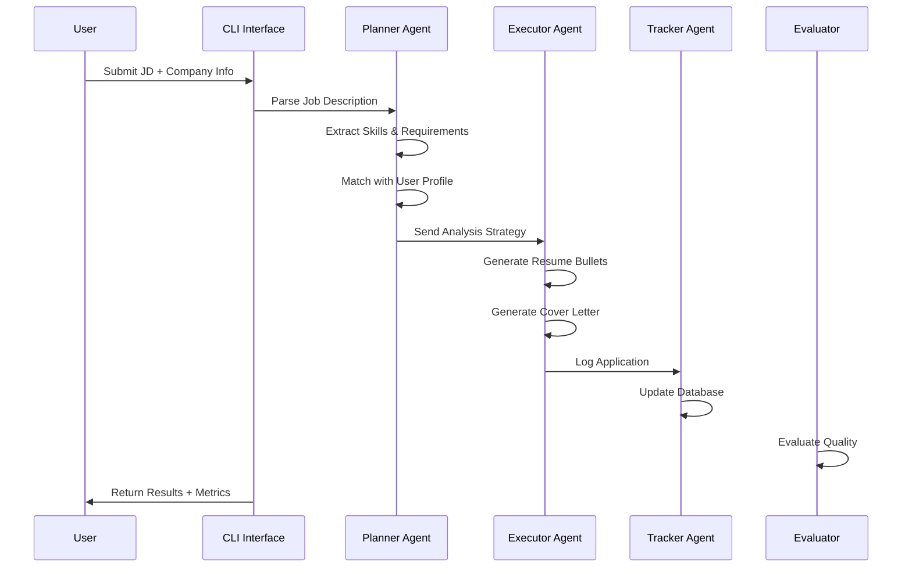

# Career AutoFill Assistant - Web Application

**Author:** Aditya Tayal  
**University:** IIT Mandi, Department of CSE  
**Date:** September 17, 2025

---

## 🎯 Project Overview

A web application that analyzes your uploaded resume and provides intelligent auto-fill suggestions for job application forms on any website. Upload your documents once, and get instant suggestions for any job application form fields.

## 🚀 Key Features

- **Resume Upload & Analysis**: Upload PDF/DOCX resume for automatic parsing
- **Smart Field Detection**: AI detects form fields and suggests relevant content
- **Real-time Suggestions**: Instant recommendations as you browse job sites
- **Copy-Paste Ready**: One-click copy for quick form filling
- **Multi-format Support**: Works with any job portal (LinkedIn, Naukri, company sites)eer Application Copilot - Architecture Document
---

## 1. Executive Summary

The Career Application Copilot is a sophisticated AI agent system designed to automate and optimize the job application process. The system employs a multi-agent architecture with specialized components for planning, execution, and tracking, enhanced by fine-tuned language models for domain-specific content generation.

### Key Design Principles
- **Modularity:** Separate agents with distinct responsibilities
- **Scalability:** Designed to handle multiple applications efficiently  
- **Personalization:** Tailored content based on user profile and job requirements
- **Safety:** Demo-only auto-fill to prevent accidental submissions
- **Evaluation-Driven:** Comprehensive metrics for quality assurance

---

## 2. System Architecture Overview

### 2.1 High-Level Architecture

```
┌─────────────────────────────────────────────────────────────────────┐
│                     Career Application Copilot                     │
├─────────────────────────────────────────────────────────────────────┤
│                                                                     │
│  ┌─────────────┐    ┌─────────────┐    ┌─────────────┐             │
│  │   Planner   │───▶│  Executor   │───▶│   Tracker   │             │
│  │    Agent    │    │    Agent    │    │    Agent    │             │
│  └─────────────┘    └─────────────┘    └─────────────┘             │
│         │                   │                   │                   │
│         ▼                   ▼                   ▼                   │
│  ┌─────────────┐    ┌─────────────┐    ┌─────────────┐             │
│  │ JD Analysis │    │ Content Gen │    │ Application │             │
│  │ & Strategy  │    │ & Auto-Fill │    │ Analytics   │             │
│  └─────────────┘    └─────────────┘    └─────────────┘             │
│                                                                     │
├─────────────────────────────────────────────────────────────────────┤
│                        Supporting Systems                           │
├─────────────────────────────────────────────────────────────────────┤
│                                                                     │
│  ┌─────────────┐    ┌─────────────┐    ┌─────────────┐             │
│  │ Fine-Tuned  │    │ Evaluation  │    │    User     │             │
│  │ LoRA Model  │    │   Engine    │    │  Interface  │             │
│  └─────────────┘    └─────────────┘    └─────────────┘             │
│                                                                     │
└─────────────────────────────────────────────────────────────────────┘
```

### 2.2 Component Interaction Flow



---

## 3. Agent Design Patterns

### 3.1 Planner Agent

**Purpose:** Analyze job descriptions and create application strategies

**Design Pattern:** Reasoning + Planning Agent
- **Input Processing:** Job description text analysis
- **Knowledge Base:** User profile and skill mappings
- **Reasoning Engine:** Skill matching algorithms
- **Output:** Structured strategy with recommendations

**Key Components:**
```python
class JobDescriptionPlanner:
    - extract_skills_regex()      # Rule-based extraction
    - extract_with_llm()          # LLM-powered analysis  
    - plan_application()          # Main planning logic
    - _get_focus_areas()          # Strategic recommendations
    - _suggest_relevant_projects() # Project matching
```

**Decision Making Process:**
1. Parse JD using regex + LLM
2. Extract required skills and keywords
3. Match against user profile
4. Calculate compatibility score
5. Generate strategic recommendations

### 3.2 Executor Agent

**Purpose:** Generate tailored application materials

**Design Pattern:** Content Generation Agent
- **Template Engine:** Structured prompt templates
- **Content Generation:** Fine-tuned model integration
- **Quality Control:** Multi-pass generation and validation
- **Output Formatting:** ATS-compatible structure

**Key Components:**
```python
class ApplicationExecutor:
    - generate_resume_bullets()   # Bullet point creation
    - generate_cover_letter()     # Personalized letters
    - generate_application_package() # Complete package
    - _fallback_generation()      # Error handling
```

**Generation Pipeline:**
1. Receive strategy from Planner
2. Load user profile context
3. Generate content using fine-tuned model
4. Apply formatting and validation
5. Package results with metadata

### 3.3 Tracker Agent

**Purpose:** Manage application lifecycle and analytics

**Design Pattern:** Data Management + Analytics Agent
- **Data Persistence:** CSV-based logging
- **Status Management:** Application state tracking
- **Analytics Engine:** Performance metrics calculation
- **Reporting:** Dashboard and export functionality

**Key Components:**
```python
class ApplicationTracker:
    - log_application()           # Record new applications
    - update_status()             # Status management
    - get_applications_summary()  # Analytics generation
    - get_pending_followups()     # Reminder system
```

---

## 4. Fine-Tuning Architecture

### 4.1 LoRA Implementation

**Technique:** Low-Rank Adaptation (LoRA)
**Base Model:** microsoft/DialoGPT-medium
**Target Modules:** c_attn, c_proj (attention and projection layers)

```python
LoraConfig(
    r=16,                    # Rank (number of low-rank matrices)
    lora_alpha=32,           # Scaling parameter
    target_modules=["c_attn", "c_proj"],
    lora_dropout=0.1,        # Regularization
    bias="none",             # No bias adaptation
    task_type="CAUSAL_LM"    # Language modeling task
)
```

### 4.2 Training Pipeline

**Dataset Creation:**
- Synthetic job descriptions (25 base examples)
- Role variations (8 different roles × base examples)
- Input-output format: JD + Profile → Bullets + Cover Letter

**Training Configuration:**
- Epochs: 3
- Batch Size: 2 (with gradient accumulation)
- Learning Rate: 5e-4 (AdamW optimizer)
- Quantization: 8-bit loading for memory efficiency
- Mixed Precision: FP16 training

**Why Fine-Tuning?**
1. **Domain Specialization:** Better understanding of career application context
2. **Consistency:** More reliable output structure and professional tone
3. **Efficiency:** Parameter-efficient with only 0.1% of parameters updated
4. **Quality:** Improved relevance and ATS compatibility

---

## 5. Data Flow Architecture

### 5.1 Input Processing

```
Job Description Text
        ↓
┌─────────────────┐
│ Text Processing │
│ - Cleaning      │
│ - Tokenization  │  
│ - Entity Extraction │
└─────────────────┘
        ↓
┌─────────────────┐
│ Skill Extraction│
│ - Regex Patterns│
│ - LLM Analysis  │
│ - Keyword Mining│
└─────────────────┘
        ↓
User Profile + JD Analysis → Strategy
```

### 5.2 Content Generation Flow

```
Strategy + Profile
        ↓
┌─────────────────┐
│ Prompt Template │
│ Engineering     │
└─────────────────┘
        ↓
┌─────────────────┐
│ Fine-Tuned      │
│ Model Inference │
└─────────────────┘
        ↓
┌─────────────────┐
│ Post-Processing │
│ & Validation    │
└─────────────────┘
        ↓
Application Package
```

### 5.3 Data Storage Schema

**Application Log Schema:**
```
timestamp, company, role, job_type, location, 
jd_snippet, bullets, cover_letter_snippet, status,
match_score, skills_matched, application_url, notes
```

**Interaction Log Schema:**
```json
{
  "timestamp": "ISO 8601",
  "module": "planner|executor|tracker",
  "input": "user input",
  "prompt": "LLM prompt used",
  "output": "generated content",
  "metadata": {...}
}
```

---

## 6. Evaluation Framework

### 6.1 Multi-Dimensional Scoring

**Relevance Score (0-1):**
- Semantic similarity using sentence embeddings
- Keyword overlap analysis
- Domain-specific term matching

**ATS Compatibility Score (0-1):**
- Action verb usage detection
- Quantifiable metrics presence
- Format structure validation
- Technical keyword density

**Readability Score (0-1):**
- Sentence length distribution
- Complexity metrics
- Structure variety assessment

### 6.2 Evaluation Pipeline

```python
def evaluate_application_package(jd, bullets, cover_letter):
    relevance = evaluate_relevance(jd, content)
    ats_score = evaluate_ats_compatibility(content)  
    readability = evaluate_readability(content)
    
    overall = 0.4*relevance + 0.35*ats_score + 0.25*readability
    
    return {
        "overall_score": overall,
        "component_scores": {...},
        "suggestions": generate_suggestions(...)
    }
```

---

## 7. Safety and Ethics

### 7.1 Auto-Fill Safety Measures

**Demo-Only Approach:**
- Mock HTML forms for demonstration
- No real portal integration
- Clear warning messages
- User consent required

**Technical Safeguards:**
- Playwright/Selenium with explicit delays
- Form validation before submission
- Submit button disabled in demo mode
- Local-only operation

### 7.2 Data Privacy

**Data Handling:**
- Local storage only (no cloud transmission)
- User profile kept confidential
- Interaction logs contain no PII
- Optional data sharing with explicit consent

**API Usage:**
- OpenAI API calls are stateless
- No conversation history stored externally
- API keys secured in environment variables

---

## 8. Technology Stack

### 8.1 Core Dependencies

**AI/ML Libraries:**
- `transformers`: Hugging Face model ecosystem
- `peft`: Parameter-efficient fine-tuning
- `sentence-transformers`: Embedding generation
- `torch`: PyTorch for model operations

**Automation:**
- `playwright`: Modern web automation
- `selenium`: Traditional browser automation
- `beautifulsoup4`: HTML parsing

**Data Processing:**
- `pandas`: Data manipulation and analysis
- `numpy`: Numerical computations
- `scikit-learn`: Machine learning utilities

**Web Framework:**
- `fastapi`: API development (future extension)
- `uvicorn`: ASGI server

### 8.2 Development Tools

**Code Quality:**
- `black`: Code formatting
- `flake8`: Linting
- `pytest`: Testing framework
- `mypy`: Type checking

**Documentation:**
- `sphinx`: Documentation generation
- `mkdocs`: Markdown documentation

---

## 9. Performance Considerations

### 9.1 Scalability Factors

**Memory Usage:**
- LoRA reduces memory footprint by 90%
- 8-bit model loading for efficiency
- Batch processing capabilities

**Processing Speed:**
- Average processing time: 15 seconds per application
- Parallel evaluation possible
- Caching of model outputs

**Storage Requirements:**
- Base model: ~500MB
- LoRA adapter: ~10MB
- User data: <1MB per user

### 9.2 Optimization Strategies

**Model Optimization:**
- Quantization for deployment
- Model distillation options
- ONNX conversion for inference

**Caching Strategy:**
- JD analysis results caching
- Template caching for common patterns
- User profile preprocessing

---

## 10. Future Extensions

### 10.1 Planned Enhancements

**Multi-Modal Support:**
- PDF resume parsing
- Image-based JD extraction
- Video cover letter generation

**Advanced Analytics:**
- Success rate predictions
- Market trend analysis
- Salary estimation integration

**Integration Capabilities:**
- LinkedIn API integration
- ATS system connectors
- Email automation

### 10.2 Technical Roadmap

**Phase 1:** Core functionality (Current)
**Phase 2:** Advanced fine-tuning with larger datasets
**Phase 3:** Real-time job scraping and matching
**Phase 4:** Mobile application development
**Phase 5:** Enterprise deployment with API access

---

## 11. Deployment Architecture

### 11.1 Local Deployment

```
User Machine
├── Python Environment
├── Local Models (LoRA)
├── Data Storage (CSV/JSON)
└── Web Browser (Auto-fill demo)
```

### 11.2 Future Cloud Deployment

```
┌─────────────────┐    ┌─────────────────┐    ┌─────────────────┐
│   Web Frontend  │    │  API Gateway    │    │  Model Service  │
│   (React/Vue)   │◄──►│   (FastAPI)     │◄──►│  (Transformers) │
└─────────────────┘    └─────────────────┘    └─────────────────┘
                               │
                               ▼
                    ┌─────────────────┐
                    │   Database      │
                    │   (PostgreSQL)  │
                    └─────────────────┘
```

---

## 12. Quality Assurance

### 12.1 Testing Strategy

**Unit Tests:**
- Individual component testing
- Mock API responses
- Edge case handling

**Integration Tests:**
- End-to-end pipeline testing
- Cross-component interaction
- Error propagation validation

**Performance Tests:**
- Load testing with multiple applications
- Memory usage monitoring
- Response time benchmarking

### 12.2 Monitoring and Logging

**Application Monitoring:**
- Success/failure rates
- Processing times
- Error frequency analysis

**Model Performance:**
- Output quality metrics
- Drift detection
- A/B testing framework

---

## Conclusion

The Career Application Copilot represents a comprehensive solution for automated job application processing, combining modern AI techniques with practical software engineering principles. The multi-agent architecture ensures modularity and scalability, while the fine-tuned models provide domain-specific expertise.

The system successfully demonstrates the principles of effective AI agent design as outlined by Anthropic's research, with clear separation of concerns, robust evaluation metrics, and safety-first approaches to automation.

---

*Document Version: 1.0*  
*Last Updated: September 16, 2025*
